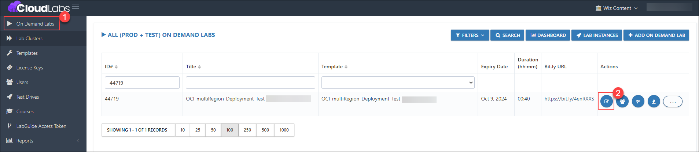
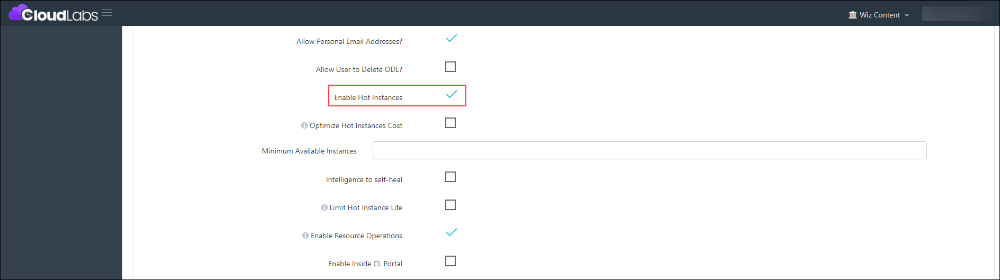
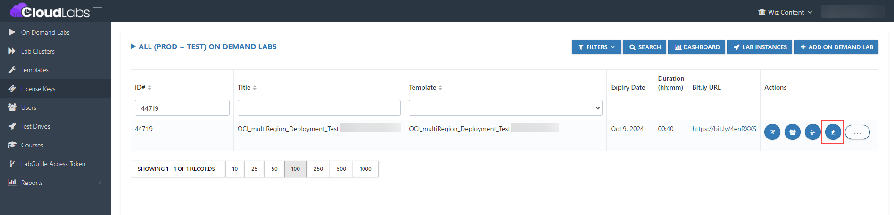
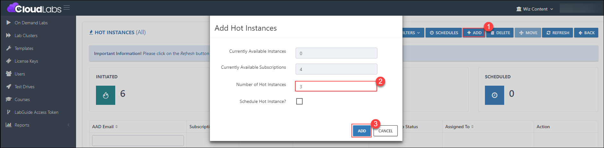
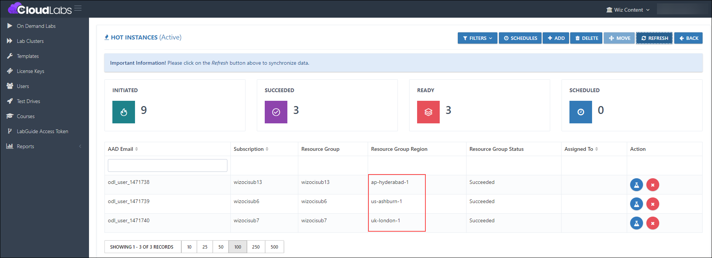

# Hot Instance in OCI

### Overview

Hot instances can now be added using OCI as the cloud platform at the template level.

### Prerequisites

- Before adding hot Instances to the ODL, ensure you have the following prerequisite:
  
  Admin access to [CloudLabs Admin Portal](https://admin.cloudlabs.ai/) (If access is unavailable, kindly reach out to your point of contact or [CloudLabs Support](https://docs.cloudlabs.ai/RequestSupport)).

### Adding Hot Instances

1. Log in to the CL portal and navigate to the required tenant (WIZ). On the left-hand side of the page, you will see the Template section.

2. Navigate to the **ODL (1)** section in the left menu and click on the **edit (2)** button.

   

3. Scroll down to the **Enable Hot Instances** section and enable the checkbox. 

   

4. Then click on the **Submit** button.

   

5. Once the ODL is submitted, click on the **Hot Instance** button.

   

6. Next, click on the **+ ADD button (1)** and provide the **Number of Hot Instances (2)** needed. Then click on the **Add (3)** button.

   

7. Once the hot instances are added, below is the output for all the regions.

   
